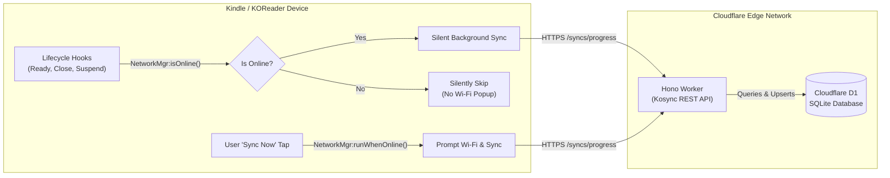

# Sink: Private KOReader Progress Sync Solution

[](https://deploy.workers.cloudflare.com/?url=https://github.com/ultimatejimmy/sink)

A complete, private reading progress synchronization solution for [KOReader](https://koreader.rocks/) on Kindle, Kobo, Android, and other e-readers, powered by a serverless **Cloudflare Worker** backend (Hono + Cloudflare D1) and a **non-intrusive KOReader Lua plugin**.

---

## Architecture Overview



---

## Repository Structure

- [`backend/`](./backend) - Cloudflare Worker implementation using TypeScript, Hono, and Cloudflare D1. Includes 1-click deploy setup, D1 schema, and automated tests.
- [`sink.koplugin/`](./sink.koplugin) - KOReader user plugin optimized for e-ink devices, non-intrusive Wi-Fi management, and silent background synchronization.

---

## 1-Click Backend Deployment

Click the button below to deploy the backend to Cloudflare Workers:

[](https://deploy.workers.cloudflare.com/?url=https://github.com/ultimatejimmy/sink)

---

## Quickstart Guide

### 1. Backend Setup
```bash
cd backend
npm install
npm run d1:init:local   # Initialize local D1 SQLite database
npm test                # Run Vitest test suite
npm run dev             # Start local development server
```

For production deployment instructions, see [`backend/README.md`](./backend/README.md).

### 2. KOReader Plugin Installation
1. Copy the [`sink.koplugin`](./sink.koplugin) folder to your device's `koreader/plugins/` directory.
2. Restart KOReader.
3. Open the menu -> **Sink Progress Sync** -> configure your **Server URL**, **Username**, and **User Key / Password**.
4. Tap **Register New Account** (or **Test Connection / Login**).

For full details, see [`sink.koplugin/README.md`](./sink.koplugin/README.md).

---

## License

MIT License
