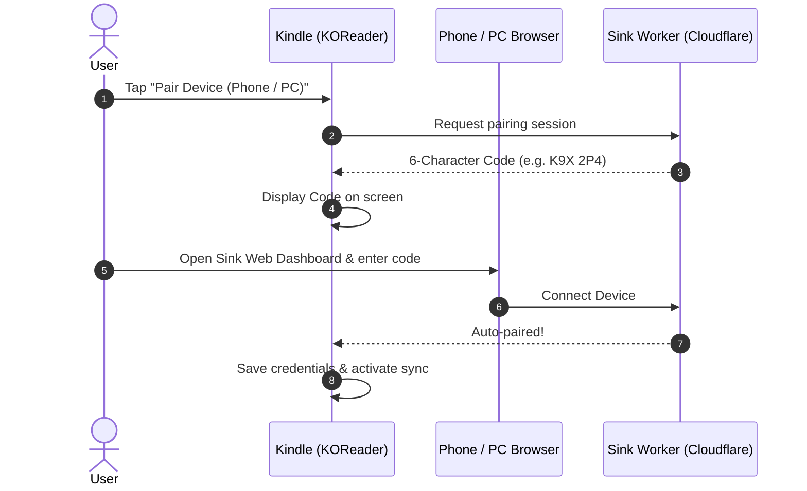

# Sink: Private KOReader Progress Sync Solution

<a href="https://deploy.workers.cloudflare.com/?url=https://github.com/ultimatejimmy/sink" target="_blank" rel="noopener noreferrer"></a>

A complete, private reading progress synchronization solution for [KOReader](https://koreader.rocks/) on Kindle, Kobo, Android, and other e-readers, powered by a serverless **Cloudflare Worker** backend (Hono + Cloudflare D1) and a **non-intrusive KOReader Lua plugin**.

---

## Zero-Password Device Pairing

Pair your Kindle / KOReader device in 5 seconds without typing passwords on an e-ink keyboard:



---

## Repository Structure

- [`backend/`](./backend) - Cloudflare Worker implementation using TypeScript, Hono, and Cloudflare D1. Includes 1-click deploy setup, pairing endpoints, and automated tests.
- [`sink.koplugin/`](./sink.koplugin) - KOReader user plugin with seamless code pairing, non-intrusive Wi-Fi management, and silent background synchronization.

---

## 1-Click Backend Deployment

Click the button below to deploy the backend to Cloudflare Workers:

<a href="https://deploy.workers.cloudflare.com/?url=https://github.com/ultimatejimmy/sink" target="_blank" rel="noopener noreferrer"></a>

---

## Quickstart Guide

### 1. Deploy the Backend
Deploy via the button above, or run locally:
```bash
cd backend
npm install
npm test                # Run Vitest test suite (17 tests)
npm run dev             # Start local development server
```

### 2. KOReader Plugin Installation
1. Copy the [`sink.koplugin`](./sink.koplugin) folder to your device's `koreader/plugins/` directory.
2. Restart KOReader.
3. Open the top menu &rarr; **Sink Progress Sync** &rarr; **Pair Device (Phone / PC)**.
4. Open your Worker URL on your phone or PC, enter the 6-character code, and tap **Connect E-Reader**.
5. Your device is now connected and reading progress will sync automatically!

---

## License

MIT License
